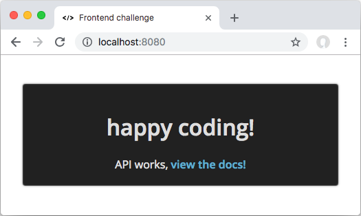

# Frontend mock db challenge

## Run

1. Navigate to it's folder and run `npm i`
2. Run `npm start` - this will bring up a simple web server (port 8080) and an API (port 8081)
3. Navigate to [http://localhost:8080](http://localhost:8080) - and you should see this:

